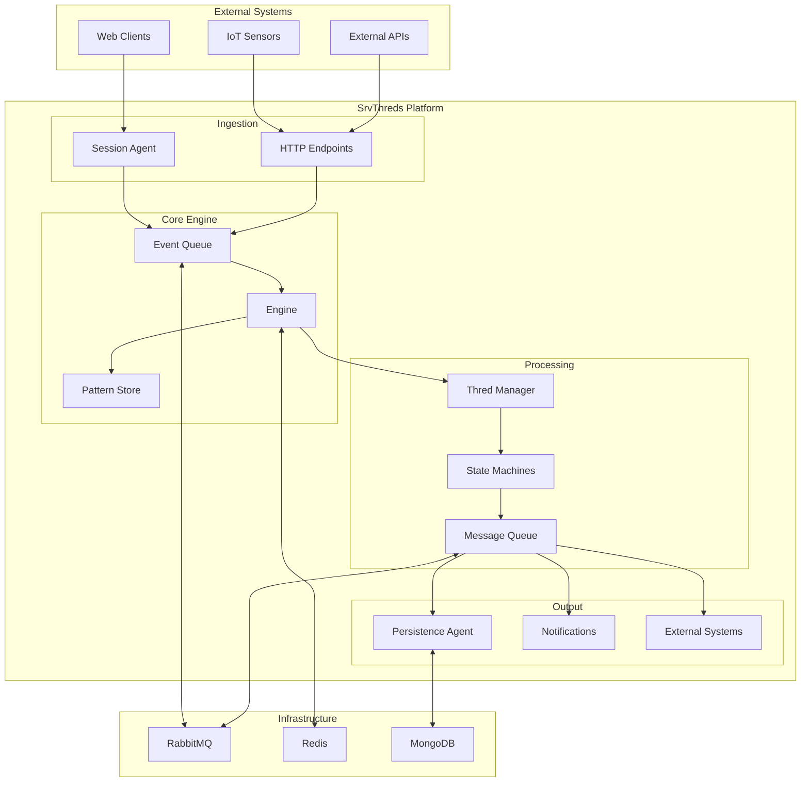

# SrvThreds Architecture Documentation

## Overview

This directory contains comprehensive architectural documentation for the **SrvThreds** platform - a sophisticated event-driven workflow automation system built on TypeScript with distributed microservices architecture.

## Documentation Structure

### 📋 [System Architecture](./architecture/SYSTEM_ARCHITECTURE.md)
**Complete technical architecture overview**
- Core architectural patterns (Event-Driven, State Machine, Actor Model, CQRS)
- Service architecture and interactions (Engine, Agents, Sessions)
- Messaging infrastructure and storage layers
- Technology stack and key architectural strengths

### 🚀 [Scalability & Performance](./architecture/SCALABILITY.md)
**Horizontal scaling and performance optimization**
- Stateless service design and distributed state management
- Horizontal scaling patterns and queue partitioning
- Performance optimizations and load balancing strategies
- Monitoring, metrics, and capacity planning

### 🐳 [Deployment Guide](./architecture/DEPLOYMENT.md)
**Containerization and production deployment**
- Multi-environment deployment strategy (Dev → Staging → Production)
- Docker containerization and Kubernetes orchestration
- CI/CD pipelines and Infrastructure as Code
- Monitoring, security, and backup strategies

### 🔄 [Data Flow Patterns](./architecture/DATA_FLOW.md)
**Event processing and message routing**
- Core data structures (Events, Messages, Patterns)
- Event processing pipeline and state machine workflows
- Message routing patterns and persistence strategies
- Performance optimization and monitoring

### ⚙️ [Configuration Management](./architecture/CONFIGURATION.md)
**Dynamic configuration and pattern management**
- Pattern definitions and agent configurations
- Hot reloading and environment-specific configurations
- Configuration validation and management tools
- Security and best practices

## Quick Start Guide

### Understanding the System

SrvThreds is designed around these core concepts:

1. **Events** - Immutable data representing state changes
2. **Patterns** - JSON-defined workflow state machines
3. **Threds** - Stateful workflow instances
4. **Agents** - Pluggable service integrations
5. **Sessions** - Participant coordination and routing

### Architecture at a Glance



### Key Features

- **Event-Driven Architecture**: Pure event-driven design with immutable events
- **State Machine Workflows**: JSON-configurable workflow patterns
- **Horizontal Scalability**: Stateless services with distributed state
- **Real-time Processing**: WebSocket and queue-based real-time event processing
- **Pluggable Agents**: Extensible agent framework for external integrations
- **Multi-tenant Sessions**: Flexible participant and session management
- **Hot Configuration**: Dynamic pattern and configuration updates
- **Fault Tolerance**: Comprehensive error handling and recovery

## Use Cases

### Industrial IoT Monitoring
- **UAV Detection**: Sensor events → Contact lookup → User notification → Video streaming
- **Downtime Management**: Equipment alerts → Escalation workflows → Resolution tracking
- **Quality Control**: Inspection events → Approval workflows → Reporting

### Business Process Automation
- **Approval Workflows**: Multi-step approval processes with escalation
- **Notification Systems**: Multi-channel notification delivery
- **Data Processing**: ETL workflows with error handling and retry logic

### Real-time Coordination
- **Team Collaboration**: Real-time event coordination across teams
- **Emergency Response**: Alert distribution and response coordination
- **Resource Management**: Dynamic resource allocation and scheduling

## Development Workflow

### 1. Pattern Development
```bash
# Create new pattern
cp src/ts/config/patterns/template.pattern.json my-workflow.pattern.json

# Validate pattern
npm run validate-pattern my-workflow.pattern.json

# Deploy pattern
npm run deploy-pattern my-workflow.pattern.json
```

### 2. Agent Development
```typescript
// Create custom agent
export class MyAgent implements MessageHandler {
  async initialize(): Promise<void> {
    // Agent initialization
  }
  
  async processMessage(message: Message): Promise<void> {
    // Process incoming messages
  }
  
  async shutdown(): Promise<void> {
    // Cleanup
  }
}
```

### 3. Testing Workflows
```bash
# Start development environment
npm run dev:up

# Run specific pattern tests
npm test -- --grep "my-workflow"

# Monitor event flow
npm run dev:logs
```

## Deployment Environments

### Development
- **Single Process**: All services in one process for debugging
- **Docker Compose**: Containerized development environment
- **Hot Reloading**: Automatic code and configuration reloading

### Staging
- **Kubernetes**: Multi-service deployment with scaling
- **Monitoring**: Comprehensive metrics and logging
- **Integration Testing**: End-to-end workflow testing

### Production
- **High Availability**: Multi-zone deployment with redundancy
- **Auto-scaling**: Horizontal pod autoscaling based on metrics
- **Observability**: Full monitoring, tracing, and alerting stack

## Performance Characteristics

### Throughput
- **Events**: 10,000+ events/second per engine instance
- **Messages**: 5,000+ messages/second per agent instance
- **Threds**: 50,000+ concurrent workflow instances

### Latency
- **Event Processing**: <10ms average latency
- **State Transitions**: <5ms per transition
- **Message Routing**: <2ms routing latency

### Scalability
- **Horizontal**: Linear scaling with additional instances
- **Vertical**: Efficient resource utilization with async processing
- **Storage**: Distributed storage with Redis clustering

## Security Model

### Authentication & Authorization
- **Multi-factor Authentication**: Support for various auth methods
- **Role-based Access Control**: Granular permissions system
- **API Security**: JWT tokens and API key management

### Data Protection
- **Encryption**: TLS/SSL for all communications
- **Data Privacy**: PII handling and GDPR compliance
- **Audit Logging**: Comprehensive audit trail

### Network Security
- **Network Policies**: Kubernetes network segmentation
- **Firewall Rules**: Restrictive ingress/egress policies
- **VPN Access**: Secure administrative access

## Monitoring & Observability

### Metrics
- **Business Metrics**: Pattern execution rates, success rates
- **System Metrics**: CPU, memory, network, storage utilization
- **Application Metrics**: Queue depths, processing latencies

### Logging
- **Structured Logging**: JSON-formatted logs with correlation IDs
- **Log Aggregation**: Centralized logging with search capabilities
- **Error Tracking**: Comprehensive error capture and alerting

### Tracing
- **Distributed Tracing**: End-to-end request tracing
- **Performance Profiling**: Application performance insights
- **Dependency Mapping**: Service dependency visualization

## Contributing

### Architecture Changes
1. **RFC Process**: Submit architecture RFC for major changes
2. **Design Review**: Peer review of architectural decisions
3. **Documentation**: Update relevant architecture documentation
4. **Testing**: Comprehensive testing of architectural changes

### Code Contributions
1. **Pattern Development**: Follow pattern development guidelines
2. **Agent Development**: Use agent framework best practices
3. **Testing**: Include unit and integration tests
4. **Documentation**: Update relevant documentation

## Support & Resources

### Documentation
- **API Documentation**: OpenAPI specifications
- **Pattern Examples**: Sample workflow patterns
- **Agent Examples**: Reference agent implementations
- **Troubleshooting**: Common issues and solutions

### Community
- **GitHub Issues**: Bug reports and feature requests
- **Discussions**: Architecture discussions and Q&A
- **Wiki**: Community-maintained documentation
- **Slack Channel**: Real-time community support

### Training
- **Architecture Workshop**: Deep-dive architecture training
- **Pattern Development**: Workflow pattern creation training
- **Operations Training**: Deployment and operations training
- **Best Practices**: Development and operational best practices

---

## Document Index

| Document | Purpose | Audience |
|----------|---------|----------|
| [System Architecture](./architecture/SYSTEM_ARCHITECTURE.md) | Complete technical overview | Architects, Senior Developers |
| [Scalability Guide](./architecture/SCALABILITY.md) | Scaling and performance | DevOps, Platform Engineers |
| [Deployment Guide](./architecture/DEPLOYMENT.md) | Production deployment | DevOps, Site Reliability Engineers |
| [Data Flow Patterns](./architecture/DATA_FLOW.md) | Event processing details | Developers, Integration Engineers |
| [Configuration Management](./architecture/CONFIGURATION.md) | Configuration and patterns | Developers, Business Analysts |

---

*This documentation is maintained by the SrvThreds development team. For questions or contributions, please see the contributing guidelines above.*