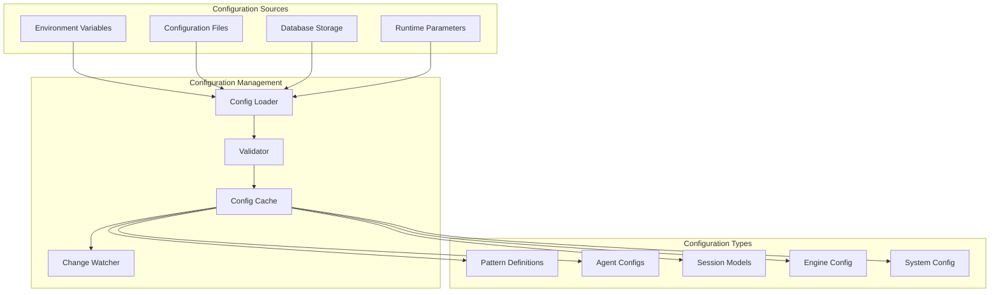

# SrvThreds: Configuration Management Architecture

## Overview

This document details the configuration management system in SrvThreds, covering pattern definitions, agent configurations, session models, and dynamic configuration capabilities. The system supports hot-reloading, environment-specific configurations, and version control.

## Configuration Architecture

### Configuration Hierarchy



## Pattern Configuration

### 1. Pattern Definition Structure

Patterns define workflow logic as JSON configurations:

```json
{
  "meta": {
    "active": true,
    "version": "1.0.0",
    "author": "system",
    "description": "UAV detection and notification workflow"
  },
  "name": "UAV Detection",
  "id": "uav_detect",
  "broadcastAllowed": false,
  "maxInstances": 100,
  "instanceInterval": 1000,
  "reactions": [
    {
      "name": "lookup_contact",
      "allowedSources": ["sensor_agent0"],
      "expiry": {
        "timeout": 30000,
        "transition": {
          "name": "timeout_handler"
        }
      },
      "condition": {
        "type": "filter",
        "xpr": "$event.type = 'org.wt.sensor.detectionEvent'",
        "onTrue": {
          "xpr": "$setLocal('coords', { 'latitude': $valueNamed('latitude'), 'longitude': $valueNamed('longitude') })"
        },
        "transform": {
          "eventDataTemplate": {
            "title": "Contact Query",
            "content": {
              "tasks": [
                {
                  "name": "find_contact",
                  "op": "get",
                  "params": {
                    "type": "ContactInfo",
                    "matcher": {
                      "sensorId": "$xpr( $valueNamed('sensorId') )"
                    }
                  }
                }
              ]
            }
          }
        },
        "publish": {
          "to": "org.wt.persistence"
        }
      }
    }
  ]
}
```

### 2. Pattern Schema Validation

```typescript
// Pattern validation schema
interface PatternModel {
  meta?: {
    active?: boolean;
    version?: string;
    author?: string;
    description?: string;
  };
  name: string;
  id?: string;
  broadcastAllowed?: boolean;
  maxInstances?: number;
  instanceInterval?: number;
  reactions: ReactionModel[];
}

interface ReactionModel {
  name?: string;
  allowedSources?: string[];
  expiry?: {
    timeout: number;
    transition?: TransitionModel;
  };
  condition: ConditionModel;
}

interface ConditionModel {
  type: 'filter' | 'and' | 'or';
  xpr?: string;                    // JSONata expression
  onTrue?: ActionModel;
  onFalse?: ActionModel;
  transform?: TransformModel;
  publish?: PublishModel;
  conditions?: ConditionModel[];   // For and/or conditions
}
```

### 3. Pattern Loading and Validation

```typescript
// From PatternsStore.ts - Pattern loading
export class PatternsStore {
  async loadPatterns(): Promise<void> {
    try {
      // Load from database
      const storedPatterns = await SystemController.get().getPatterns();
      
      // Validate each pattern
      for (const patternData of storedPatterns) {
        const validation = this.validatePattern(patternData);
        if (!validation.valid) {
          Logger.error(`Invalid pattern ${patternData.id}: ${validation.errors.join(', ')}`);
          continue;
        }
        
        const pattern = new Pattern(patternData);
        this.patterns.push(pattern);
        Logger.info(`Loaded pattern: ${pattern.name} (${pattern.id})`);
      }
    } catch (e) {
      Logger.error('Failed to load patterns from storage', e);
      throw e;
    }
  }
  
  private validatePattern(patternData: any): ValidationResult {
    // JSON Schema validation
    const ajv = new Ajv();
    const validate = ajv.compile(PATTERN_SCHEMA);
    const valid = validate(patternData);
    
    return {
      valid,
      errors: validate.errors?.map(err => err.message) || []
    };
  }
}
```

### 4. Hot Reloading Patterns

```typescript
// Pattern hot reloading implementation
export class PatternsStore {
  async initialize(): Promise<void> {
    await this.loadPatterns();
    
    // Subscribe to pattern changes
    await PubSubFactory.getSub().subscribe([Topics.PatternChanged], async (topic, message) => {
      await this.reloadPattern(message.id);
    });
  }
  
  private async reloadPattern(patternId: string): Promise<void> {
    try {
      Logger.info(`Reloading pattern: ${patternId}`);
      
      // Remove old pattern
      this.patterns = this.patterns.filter(p => p.id !== patternId);
      
      // Load new pattern
      const patternData = await SystemController.get().getPattern(patternId);
      if (patternData && patternData.meta?.active !== false) {
        const pattern = new Pattern(patternData);
        this.patterns.push(pattern);
        Logger.info(`Reloaded pattern: ${pattern.name}`);
      }
    } catch (e) {
      Logger.error(`Failed to reload pattern ${patternId}`, e);
    }
  }
}
```

## Agent Configuration

### 1. Agent Configuration Structure

```json
{
  "nodeId": "session_agent_1",
  "nodeType": "org.wt.session",
  "name": "Session Management Agent",
  "description": "Handles client sessions and WebSocket connections",
  "agentImpl": "../agent/session/SessionAgent.js",
  "customConfig": {
    "port": 3002,
    "maxConnections": 1000,
    "heartbeatInterval": 30000,
    "sessionTimeout": 300000
  },
  "resources": {
    "cpu": "500m",
    "memory": "1Gi",
    "storage": "10Gi"
  },
  "scaling": {
    "minInstances": 1,
    "maxInstances": 10,
    "targetCPU": 70,
    "targetMemory": 80
  }
}
```

### 2. Dynamic Agent Configuration Loading

```typescript
// From Agent.ts - Dynamic configuration loading
export class Agent {
  async start() {
    const { configName } = this.params;
    
    // Load configuration from persistence or use provided config
    this.agentConfig = this.params.agentConfig
      ? this.params.agentConfig
      : await SystemController.get().getConfig(configName);
      
    if (!this.agentConfig) {
      throw new Error(`Agent: failed to load config for ${configName}`);
    }
    
    // Validate configuration
    const validation = this.validateConfig(this.agentConfig);
    if (!validation.valid) {
      throw new Error(`Invalid agent config: ${validation.errors.join(', ')}`);
    }
    
    // Dynamic module loading based on configuration
    let Handler;
    if (typeof this.agentConfig.agentImpl === 'string') {
      const module = await import(this.agentConfig.agentImpl);
      Handler = module.default;
    } else {
      Handler = this.agentConfig.agentImpl;
    }
    
    // Initialize handler with configuration
    this.handler = new Handler({
      config: this.agentConfig,
      eventPublisher: this.eventPublisher,
      additionalArgs: this.params.additionalArgs
    });
    
    await this.handler?.initialize();
    Logger.debug(`Agent.start(): ${this.agentConfig.nodeId} initialized.`);
  }
}
```

### 3. Agent Configuration Schema

```typescript
interface AgentConfig {
  nodeId: string;                    // Unique agent identifier
  nodeType: string;                  // Agent type for routing
  name: string;                      // Human-readable name
  description?: string;              // Agent description
  agentImpl: string | Function;      // Implementation class/path
  customConfig?: Record<string, any>; // Agent-specific configuration
  resources?: {                      // Resource requirements
    cpu?: string;
    memory?: string;
    storage?: string;
  };
  scaling?: {                        // Scaling configuration
    minInstances?: number;
    maxInstances?: number;
    targetCPU?: number;
    targetMemory?: number;
  };
  monitoring?: {                     // Monitoring configuration
    healthCheck?: string;
    metricsPort?: number;
    logLevel?: string;
  };
}
```

## Session Configuration

### 1. Session Model Structure

```json
{
  "groups": [
    {
      "name": "operations_team",
      "description": "Operations and monitoring team",
      "participants": [
        {
          "participantId": "ops_user_1",
          "name": "Operations Manager",
          "roles": ["operator", "admin"],
          "channels": [
            {
              "type": "websocket",
              "endpoint": "ws://localhost:3002"
            },
            {
              "type": "sms",
              "number": "+1234567890"
            },
            {
              "type": "email",
              "address": "ops@company.com"
            }
          ]
        }
      ],
      "policies": {
        "maxConcurrentSessions": 5,
        "sessionTimeout": 1800000,
        "allowBroadcast": true,
        "requireAuth": true
      }
    }
  ],
  "resolvers": [
    {
      "pattern": "@ops",
      "target": "operations_team"
    },
    {
      "pattern": "$admin",
      "target": "role:admin"
    }
  ]
}
```

### 2. Address Resolution Configuration

```typescript
// From AddressResolver.ts - Address resolution
export class AddressResolver {
  constructor(
    private groups: Group[],
    private resolverConfig: ResolverConfig,
    private storage: SessionStorage
  ) {
    this.buildResolverMap();
  }
  
  private buildResolverMap(): void {
    // Build resolver patterns from configuration
    this.resolverConfig.resolvers?.forEach(resolver => {
      this.resolverMap.set(resolver.pattern, resolver.target);
    });
    
    // Add group resolvers
    this.groups.forEach(group => {
      this.resolverMap.set(`@${group.name}`, `group:${group.name}`);
    });
  }
  
  async getParticipantIdsFor(address: Address, thredContext?: ThredContext): Promise<string[]> {
    const addresses = Array.isArray(address) ? address : [address];
    const participantIds: string[] = [];
    
    for (const addr of addresses) {
      if (addr.startsWith('@')) {
        // Group address
        const groupName = addr.substring(1);
        const group = this.groups.find(g => g.name === groupName);
        if (group) {
          participantIds.push(...group.participants.map(p => p.participantId));
        }
      } else if (addr.startsWith('$')) {
        // Special address (role, thred, etc.)
        const resolved = await this.resolveSpecialAddress(addr, thredContext);
        participantIds.push(...resolved);
      } else {
        // Direct participant ID
        participantIds.push(addr);
      }
    }
    
    return [...new Set(participantIds)]; // Remove duplicates
  }
}
```

## Engine Configuration

### 1. Engine Configuration Structure

```json
{
  "processing": {
    "batchSize": 100,
    "batchTimeout": 1000,
    "maxConcurrentThreds": 10000,
    "defaultThredTimeout": 3600000
  },
  "queues": {
    "eventQueue": {
      "prefetch": 10,
      "retryAttempts": 3,
      "retryDelay": 5000
    },
    "messageQueue": {
      "prefetch": 5,
      "retryAttempts": 5,
      "retryDelay": 2000
    }
  },
  "storage": {
    "redis": {
      "keyPrefix": "srvthreds:",
      "ttl": 86400,
      "maxConnections": 20
    },
    "mongodb": {
      "database": "srvthreds",
      "collection": "events",
      "maxPoolSize": 10
    }
  },
  "monitoring": {
    "metricsInterval": 30000,
    "healthCheckInterval": 10000,
    "logLevel": "info"
  }
}
```

### 2. Configuration Loading

```typescript
// From Config.ts - Engine configuration
export class Config {
  static engineConfig: EngineConfig;
  
  static initialize(configPath?: string): void {
    const configFile = configPath || process.env.ENGINE_CONFIG || './config/engine.json';
    
    try {
      const configData = JSON.parse(fs.readFileSync(configFile, 'utf8'));
      this.engineConfig = this.validateAndMergeConfig(configData);
      Logger.info(`Engine configuration loaded from ${configFile}`);
    } catch (e) {
      Logger.error(`Failed to load engine configuration from ${configFile}`, e);
      // Use default configuration
      this.engineConfig = this.getDefaultConfig();
    }
  }
  
  private static validateAndMergeConfig(configData: any): EngineConfig {
    // Merge with defaults
    const config = {
      ...this.getDefaultConfig(),
      ...configData
    };
    
    // Validate configuration
    const validation = this.validateConfig(config);
    if (!validation.valid) {
      throw new Error(`Invalid engine configuration: ${validation.errors.join(', ')}`);
    }
    
    return config;
  }
}
```

## Environment-Specific Configuration

### 1. Configuration Profiles

```typescript
// Environment-specific configuration loading
export class ConfigLoader {
  static load<T>(configName: string, environment?: string): T {
    const env = environment || process.env.NODE_ENV || 'development';
    const configPaths = [
      `./config/${configName}.${env}.json`,
      `./config/${configName}.json`,
      `./config/default/${configName}.json`
    ];
    
    for (const configPath of configPaths) {
      try {
        if (fs.existsSync(configPath)) {
          const configData = JSON.parse(fs.readFileSync(configPath, 'utf8'));
          Logger.info(`Loaded configuration from ${configPath}`);
          return this.processConfig(configData, env);
        }
      } catch (e) {
        Logger.warn(`Failed to load configuration from ${configPath}`, e);
      }
    }
    
    throw new Error(`No configuration found for ${configName} in environment ${env}`);
  }
  
  private static processConfig<T>(configData: any, environment: string): T {
    // Process environment variables
    const processed = this.substituteEnvironmentVariables(configData);
    
    // Apply environment-specific overrides
    if (processed.environments && processed.environments[environment]) {
      Object.assign(processed, processed.environments[environment]);
      delete processed.environments;
    }
    
    return processed;
  }
  
  private static substituteEnvironmentVariables(obj: any): any {
    if (typeof obj === 'string') {
      return obj.replace(/\$\{([^}]+)\}/g, (match, envVar) => {
        return process.env[envVar] || match;
      });
    } else if (Array.isArray(obj)) {
      return obj.map(item => this.substituteEnvironmentVariables(item));
    } else if (obj && typeof obj === 'object') {
      const result: any = {};
      for (const [key, value] of Object.entries(obj)) {
        result[key] = this.substituteEnvironmentVariables(value);
      }
      return result;
    }
    return obj;
  }
}
```

### 2. Configuration Examples by Environment

```json
// config/engine.development.json
{
  "processing": {
    "batchSize": 10,
    "maxConcurrentThreds": 100
  },
  "storage": {
    "redis": {
      "url": "redis://localhost:6379"
    }
  },
  "monitoring": {
    "logLevel": "debug"
  }
}
```

```json
// config/engine.production.json
{
  "processing": {
    "batchSize": 1000,
    "maxConcurrentThreds": 50000
  },
  "storage": {
    "redis": {
      "url": "${REDIS_CLUSTER_URL}",
      "cluster": true
    }
  },
  "monitoring": {
    "logLevel": "warn",
    "metricsEnabled": true
  }
}
```

## Configuration Validation

### 1. JSON Schema Validation

```typescript
// Configuration validation schemas
const PATTERN_SCHEMA = {
  type: 'object',
  required: ['name', 'reactions'],
  properties: {
    name: { type: 'string', minLength: 1 },
    id: { type: 'string', pattern: '^[a-z0-9_]+$' },
    reactions: {
      type: 'array',
      minItems: 1,
      items: {
        type: 'object',
        required: ['condition'],
        properties: {
          name: { type: 'string' },
          condition: { $ref: '#/definitions/condition' }
        }
      }
    }
  },
  definitions: {
    condition: {
      type: 'object',
      required: ['type'],
      properties: {
        type: { enum: ['filter', 'and', 'or'] },
        xpr: { type: 'string' }
      }
    }
  }
};

const AGENT_CONFIG_SCHEMA = {
  type: 'object',
  required: ['nodeId', 'nodeType', 'agentImpl'],
  properties: {
    nodeId: { type: 'string', pattern: '^[a-zA-Z0-9_]+$' },
    nodeType: { type: 'string', pattern: '^[a-z0-9.]+$' },
    agentImpl: { type: 'string' }
  }
};
```

### 2. Runtime Validation

```typescript
// Runtime configuration validation
export class ConfigValidator {
  static validatePattern(pattern: PatternModel): ValidationResult {
    const ajv = new Ajv({ allErrors: true });
    const validate = ajv.compile(PATTERN_SCHEMA);
    const valid = validate(pattern);
    
    const errors: string[] = [];
    if (!valid && validate.errors) {
      errors.push(...validate.errors.map(err => 
        `${err.instancePath}: ${err.message}`
      ));
    }
    
    // Additional business logic validation
    if (pattern.reactions) {
      pattern.reactions.forEach((reaction, index) => {
        if (!reaction.name && pattern.reactions!.length > 1) {
          errors.push(`Reaction ${index}: name is required when multiple reactions exist`);
        }
      });
    }
    
    return { valid: errors.length === 0, errors };
  }
  
  static validateAgentConfig(config: AgentConfig): ValidationResult {
    const ajv = new Ajv({ allErrors: true });
    const validate = ajv.compile(AGENT_CONFIG_SCHEMA);
    const valid = validate(config);
    
    const errors: string[] = [];
    if (!valid && validate.errors) {
      errors.push(...validate.errors.map(err => 
        `${err.instancePath}: ${err.message}`
      ));
    }
    
    return { valid: errors.length === 0, errors };
  }
}
```

## Configuration Management Tools

### 1. Configuration CLI

```typescript
// CLI tool for configuration management
export class ConfigCLI {
  static async validatePattern(filePath: string): Promise<void> {
    try {
      const patternData = JSON.parse(fs.readFileSync(filePath, 'utf8'));
      const validation = ConfigValidator.validatePattern(patternData);
      
      if (validation.valid) {
        console.log(`✅ Pattern ${patternData.name} is valid`);
      } else {
        console.log(`❌ Pattern validation failed:`);
        validation.errors.forEach(error => console.log(`  - ${error}`));
        process.exit(1);
      }
    } catch (e) {
      console.error(`Failed to validate pattern: ${e.message}`);
      process.exit(1);
    }
  }
  
  static async deployPattern(filePath: string): Promise<void> {
    try {
      const patternData = JSON.parse(fs.readFileSync(filePath, 'utf8'));
      
      // Validate before deployment
      const validation = ConfigValidator.validatePattern(patternData);
      if (!validation.valid) {
        throw new Error(`Invalid pattern: ${validation.errors.join(', ')}`);
      }
      
      // Deploy to database
      await SystemController.get().savePattern(patternData);
      
      // Notify running instances
      await PubSubFactory.getPub().publish(Topics.PatternChanged, {
        id: patternData.id,
        action: 'updated'
      });
      
      console.log(`✅ Pattern ${patternData.name} deployed successfully`);
    } catch (e) {
      console.error(`Failed to deploy pattern: ${e.message}`);
      process.exit(1);
    }
  }
}
```

### 2. Configuration API

```typescript
// REST API for configuration management
export class ConfigAPI {
  static setupRoutes(app: Express): void {
    // Get pattern
    app.get('/api/config/patterns/:id', async (req, res) => {
      try {
        const pattern = await SystemController.get().getPattern(req.params.id);
        if (!pattern) {
          return res.status(404).json({ error: 'Pattern not found' });
        }
        res.json(pattern);
      } catch (e) {
        res.status(500).json({ error: e.message });
      }
    });
    
    // Update pattern
    app.put('/api/config/patterns/:id', async (req, res) => {
      try {
        const validation = ConfigValidator.validatePattern(req.body);
        if (!validation.valid) {
          return res.status(400).json({ 
            error: 'Invalid pattern', 
            details: validation.errors 
          });
        }
        
        await SystemController.get().savePattern(req.body);
        
        // Notify running instances
        await PubSubFactory.getPub().publish(Topics.PatternChanged, {
          id: req.params.id,
          action: 'updated'
        });
        
        res.json({ success: true });
      } catch (e) {
        res.status(500).json({ error: e.message });
      }
    });
  }
}
```

## Best Practices

### 1. Configuration Design

- **Immutability**: Treat configurations as immutable once deployed
- **Validation**: Always validate configurations before deployment
- **Versioning**: Version configurations for rollback capability
- **Documentation**: Include comprehensive documentation in configurations

### 2. Environment Management

- **Separation**: Maintain strict separation between environments
- **Secrets**: Never store secrets in configuration files
- **Defaults**: Provide sensible defaults for all configuration values
- **Override Hierarchy**: Implement clear override hierarchy

### 3. Hot Reloading

- **Safety**: Validate configurations before applying changes
- **Atomicity**: Apply configuration changes atomically
- **Rollback**: Support rollback for failed configuration changes
- **Monitoring**: Monitor configuration changes and their effects

### 4. Security

- **Access Control**: Implement proper access control for configuration changes
- **Audit Trail**: Maintain audit trail of all configuration changes
- **Encryption**: Encrypt sensitive configuration data
- **Validation**: Validate all configuration inputs

---

*This document provides comprehensive guidance for managing configurations in SrvThreds. For specific implementation examples, refer to the source code and configuration files in the project.*