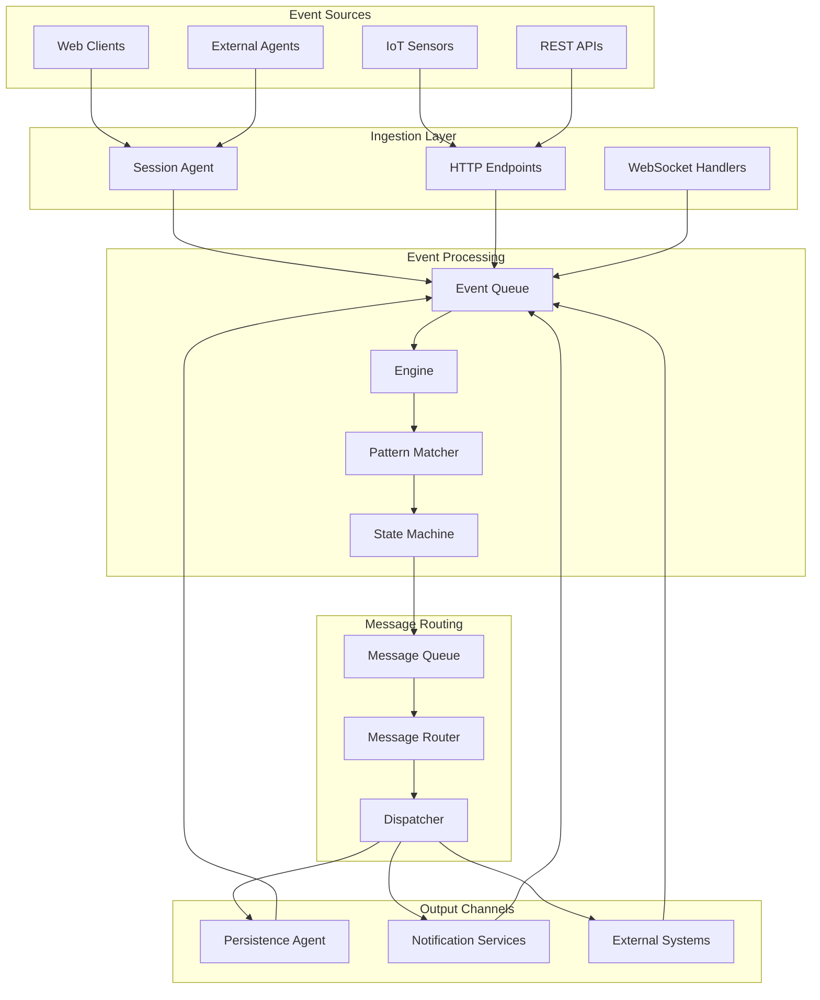
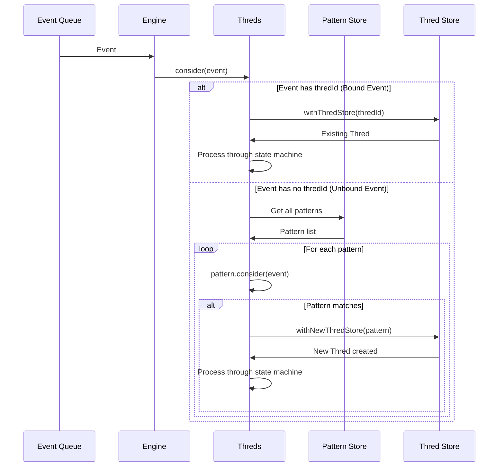
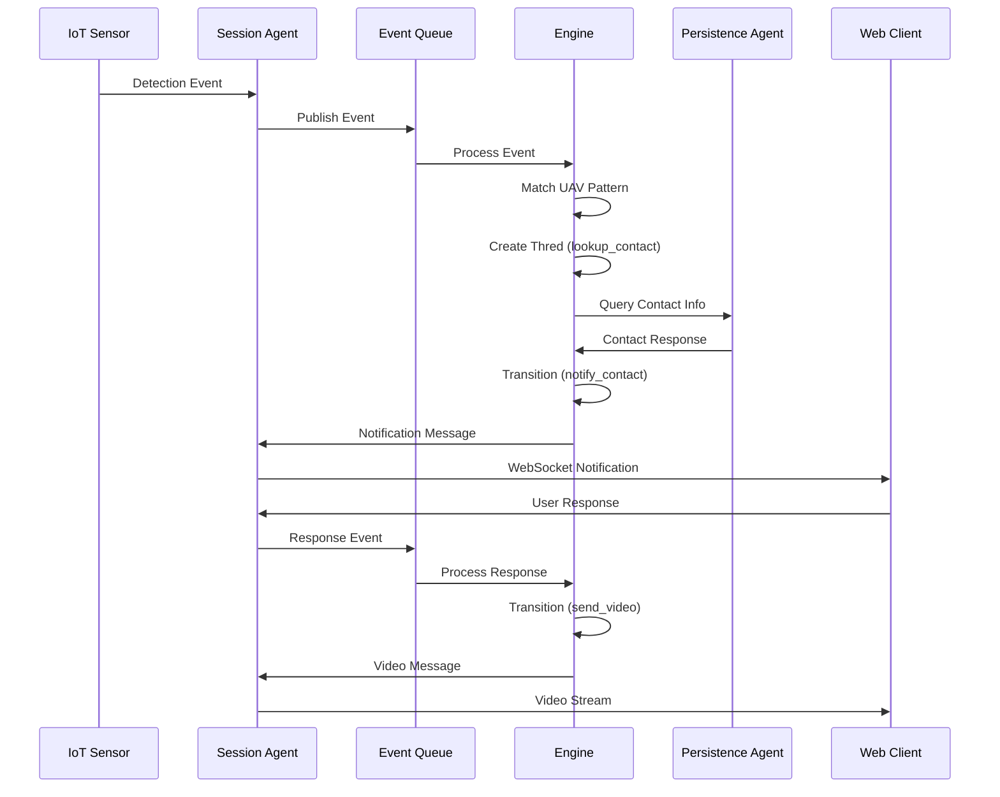
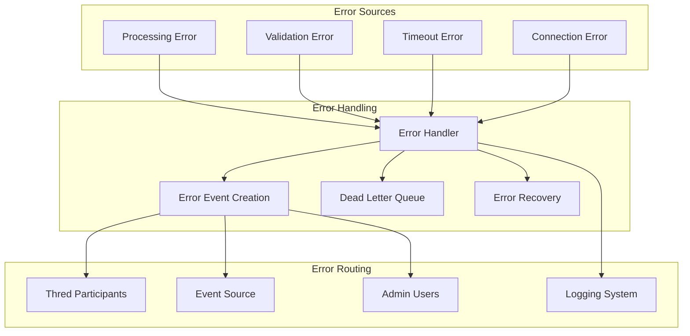

# SrvThreds: Data Flow Patterns & Event Architecture

## Overview

This document details the data flow patterns, event processing pipelines, and message routing strategies within the SrvThreds platform. Understanding these patterns is crucial for system integration, debugging, and optimization.

## Core Data Structures

### 1. Event Structure

Events are the fundamental data units in the system:

```typescript
// From thredlib - Core Event structure
interface Event {
    id: string;                    // Unique event identifier
    type: string;                  // Event type (e.g., 'org.wt.sensor.detectionEvent')
    thredId?: string;              // Associated workflow instance ID
    re?: string;                   // Reference to previous event (reply-to)
    source: {                      // Event source information
        id: string;                // Source identifier
        name?: string;             // Human-readable source name
    };
    data: {                        // Event payload
        title: string;             // Event title
        content?: any;             // Event-specific data
        error?: EventError;        // Error information if applicable
    };
    timestamp?: number;            // Event creation timestamp
}
```

### 2. Message Structure

Messages are addressed events sent to specific participants:

```typescript
// From thredlib - Message structure
interface Message {
    id: string;                    // Message identifier
    event: Event;                  // Wrapped event
    to: string[];                  // Target participant IDs
    timestamp: number;             // Message creation timestamp
}
```

### 3. Pattern Structure

Patterns define workflow logic as state machines:

```typescript
// Pattern definition structure
interface PatternModel {
    id: string;                    // Pattern identifier
    name: string;                  // Human-readable name
    reactions: ReactionModel[];    // State definitions
    broadcastAllowed?: boolean;    // Allow broadcast messages
    maxInstances?: number;         // Concurrent instance limit
}
```

## Event Flow Architecture

### High-Level Data Flow



## Detailed Event Processing Pipeline

### 1. Event Ingestion

Events enter the system through multiple channels:

```typescript
// From SessionAgent.ts - WebSocket event ingestion
export class SessionAgent implements MessageHandler {
    constructor({ config, eventPublisher }: MessageHandlerParams) {
        this.socketService = new SocketService({
            serviceListener: new SessionServiceListener(this.sessionService),
            publisher: this.eventPublisher,  // Publishes to Event Queue
            nodeId: this.agentConfig.nodeId,
        });
    }
}
```

**Ingestion Flow:**
1. **Client Connection**: WebSocket/HTTP connection established
2. **Event Reception**: Raw event data received
3. **Event Validation**: Structure and content validation
4. **Event Publishing**: Event published to Event Queue
5. **Acknowledgment**: Client receives confirmation

### 2. Event Queue Processing

The Engine continuously processes events from the queue:

```typescript
// From Engine.ts - Event processing loop
export class Engine implements MessageHandler {
    private async run() {
        while (true) {
            const message: QMessage<Event> = await this.inboundQ.pop();
            const timestamp = Date.now();
            try {
                // Persist event before processing
                await Sc.get().replaceEvent({ event: message.payload, timestamp });
                
                // Process event through state machines
                await this.consider(message.payload);
                
                // Remove from queue on success
                await this.inboundQ.delete(message);
            } catch (e) {
                // Handle errors and move to dead letter queue
                await this.inboundQ.reject(message, e as Error);
                await this.handleError(e, message.payload);
            }
        }
    }
}
```

### 3. Pattern Matching & Thred Management

Events are matched against patterns to create or update workflow instances:



### 4. State Machine Processing

Each Thred processes events through its state machine:

```typescript
// From Thred.ts - State machine processing
static async consider(event: Event, thredStore: ThredStore, threds: Threds): Promise<void> {
    let inputEvent: Event | undefined = event;
    
    // Synchronize state (handle expirations, etc.)
    await Thred.synchronizeThredState(thredStore, threds);
    
    // Process through state transitions
    transitionLoop: do {
        // Apply event to current reaction
        const reactionResult = await thredStore.currentReaction?.apply(inputEvent, thredStore);
        
        if (!reactionResult) break transitionLoop;
        
        // Transition to next state
        inputEvent = await Thred.nextReaction(thredStore, reactionResult.transition, inputEvent);
        
        // Dispatch any resulting messages
        if (reactionResult.messageTemplate) {
            const to = await this.resolveAndUpdateParticipants(
                addressToArray(reactionResult.messageTemplate.to),
                event.source.id,
                thredStore,
                threds
            );
            await threds.handleMessage({ ...reactionResult.messageTemplate, to });
        }
    } while (inputEvent);
}
```

## Message Routing Patterns

### 1. Address Resolution

Messages are routed based on participant addresses:

```typescript
// From Sessions.ts - Address resolution
export class Sessions {
    getParticipantIdsFor(address: Address, thredContext?: ThredContext): Promise<string[]> {
        return this.addressResolver.getParticipantIdsFor(address, thredContext);
    }
}

// Address types supported:
// - Direct: "user123"
// - Group: "@group1"
// - Role: "$admin"
// - Thred: "$thred"
// - Broadcast: "*"
```

### 2. Message Queue Routing

Messages are routed through topic-based queues:

```json
// RabbitMQ routing configuration
{
  "bindings": [
    "message-exchange[org.wt.session1] -> session1-message-queue",
    "message-exchange[org.wt.persistence] -> persistence-message-queue",
    "message-exchange[org.wt.sms] -> sms-message-queue"
  ]
}
```

### 3. Agent Message Processing

Agents process messages based on their configuration:

```typescript
// From Agent.ts - Message processing
export class Agent {
    private async run() {
        const { messageQ } = this.params;
        while (true) {
            // Accept messages for this agent's nodeId or nodeType
            const topics = [this.agentConfig!.nodeId, this.agentConfig!.nodeType];
            const qMessage: QMessage<Message> = await messageQ.pop(topics);
            
            try {
                await this.processMessage(qMessage.payload);
                await messageQ.delete(qMessage);
            } catch (e) {
                // Create error event and publish back to engine
                const outboundEvent = this.eventPublisher.createOutboundEvent({
                    error: { ...errorCodes[errorKeys.TASK_ERROR], cause: e },
                    prevEvent: qMessage.payload.event,
                });
                await this.eventPublisher.publishEvent(outboundEvent);
                await messageQ.reject(qMessage, e as Error);
            }
        }
    }
}
```

## Specific Flow Examples

### 1. UAV Detection Workflow



### 2. Error Handling Flow



## Data Persistence Patterns

### 1. Event Sourcing

All events are persisted for audit and replay:

```typescript
// From Engine.ts - Event persistence
private async run() {
    while (true) {
        const message: QMessage<Event> = await this.inboundQ.pop();
        const timestamp = Date.now();
        try {
            // Persist event BEFORE processing
            await Sc.get().replaceEvent({ event: message.payload, timestamp });
            await this.consider(message.payload);
            await this.inboundQ.delete(message);
        } catch (e) {
            // Persist error state
            await Sc.get().replaceEvent({ 
                event: message.payload, 
                error: e, 
                timestamp 
            });
        }
    }
}
```

### 2. State Snapshots

Thred state is persisted at each transition:

```typescript
// From ThredsStore.ts - State persistence
async withThredStore(thredId: string, op: (thredStore?: ThredStore) => Promise<any>): Promise<any> {
    return await this.storage.acquire(
        [{ type: Types.Thred, id: thredId }],
        [async () => {
            const thredStore = await this.getThreadStore(thredId);
            try {
                const result = await op(thredStore);
                // Save state after operation
                if (thredStore) await this.saveThredStore(thredStore);
                return result;
            } finally {
                delete this.thredStores[thredId];
            }
        }]
    );
}
```

### 3. Audit Trail

Comprehensive logging of all state transitions:

```typescript
// From Thred.ts - Audit logging
private static async logTransition(
    thredStore: ThredStore, 
    event: Event, 
    fromReaction?: string, 
    toReaction?: string
) {
    await Pm.get().saveThredLogRecord({
        thredId: thredStore.id,
        eventId: event.id,
        type: ThredLogRecordType.MATCH,
        fromReaction,
        toReaction,
        timestamp: Date.now(),
    });
}
```

## Performance Optimization Patterns

### 1. Batch Processing

Events can be processed in batches for high throughput:

```typescript
// Batch processing implementation
class BatchEventProcessor {
    private batch: Event[] = [];
    private readonly batchSize = 100;
    private readonly flushInterval = 1000;
    
    constructor() {
        setInterval(() => this.flush(), this.flushInterval);
    }
    
    add(event: Event): void {
        this.batch.push(event);
        if (this.batch.length >= this.batchSize) {
            this.flush();
        }
    }
    
    private async flush(): Promise<void> {
        if (this.batch.length > 0) {
            const events = this.batch.splice(0);
            await this.processBatch(events);
        }
    }
}
```

### 2. Connection Pooling

Database connections are pooled for efficiency:

```typescript
// From StorageFactory.ts - Connection pooling
export class StorageFactory {
    private static storage?: Storage;
    
    static getStorage(): Storage {
        if (!StorageFactory.storage) {
            // Single instance with connection pooling
            StorageFactory.storage = new RedisStorage();
        }
        return StorageFactory.storage;
    }
}
```

### 3. Caching Strategies

Multi-level caching for frequently accessed data:

```typescript
// Caching pattern implementation
class CachedPatternStore {
    private cache = new Map<string, Pattern>();
    private readonly ttl = 300000; // 5 minutes
    
    async getPattern(id: string): Promise<Pattern | undefined> {
        // L1: Memory cache
        if (this.cache.has(id)) {
            return this.cache.get(id);
        }
        
        // L2: Redis cache
        const cached = await this.redis.get(`pattern:${id}`);
        if (cached) {
            const pattern = JSON.parse(cached);
            this.cache.set(id, pattern);
            return pattern;
        }
        
        // L3: Database
        const pattern = await this.database.getPattern(id);
        if (pattern) {
            this.cache.set(id, pattern);
            await this.redis.setex(`pattern:${id}`, this.ttl, JSON.stringify(pattern));
        }
        
        return pattern;
    }
}
```

## Monitoring & Observability

### 1. Event Metrics

Key metrics tracked throughout the data flow:

```typescript
// Metrics collection points
interface EventMetrics {
    eventsReceived: number;        // Total events ingested
    eventsProcessed: number;       // Successfully processed events
    eventsFailed: number;          // Failed event processing
    averageProcessingTime: number; // Processing latency
    queueDepth: number;           // Current queue depth
    activeThreds: number;         // Active workflow instances
    patternMatches: number;       // Pattern matching success rate
}
```

### 2. Distributed Tracing

Events carry trace information for end-to-end tracking:

```typescript
// Tracing implementation
interface TraceContext {
    traceId: string;              // Unique trace identifier
    spanId: string;               // Current span identifier
    parentSpanId?: string;        // Parent span reference
    baggage?: Record<string, any>; // Trace metadata
}

// Events include trace context
interface TracedEvent extends Event {
    trace?: TraceContext;
}
```

## Best Practices

### 1. Event Design

- **Immutability**: Events should be immutable once created
- **Self-Describing**: Include all necessary context in the event
- **Versioning**: Support event schema evolution
- **Idempotency**: Design for idempotent processing

### 2. Message Routing

- **Topic Strategy**: Use hierarchical topic naming
- **Load Balancing**: Distribute messages across consumers
- **Dead Letter Handling**: Implement comprehensive error handling
- **Backpressure**: Handle queue overflow gracefully

### 3. State Management

- **Consistency**: Use distributed locking for state consistency
- **Persistence**: Persist state at appropriate boundaries
- **Recovery**: Design for state recovery and replay
- **Cleanup**: Implement state cleanup for terminated workflows

---

*This document provides comprehensive coverage of data flow patterns in SrvThreds. For implementation details, refer to the source code and related architectural documentation.*