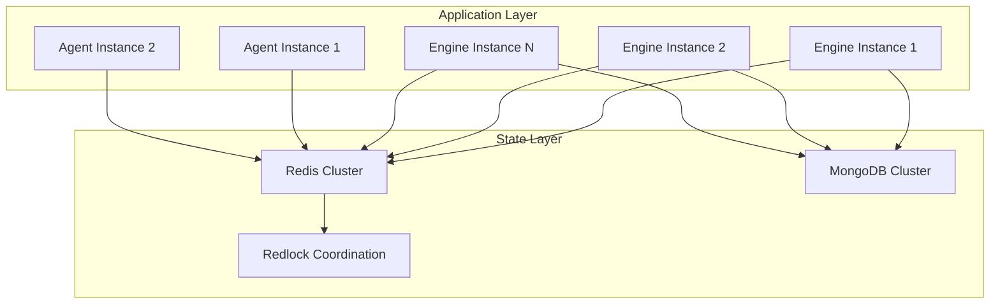
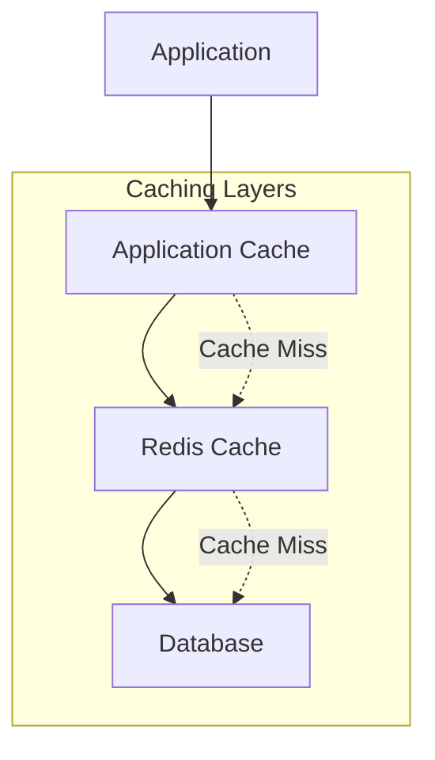

# SrvThreds: Scalability & Performance Architecture

## Overview

This document details the scalability patterns, performance optimizations, and horizontal scaling strategies implemented in the SrvThreds platform.

## Scalability Design Principles

### 1. Stateless Service Design

All core services are designed to be stateless, enabling horizontal scaling:

```typescript
// Engine is stateless - state is externalized to Redis/MongoDB
export class Engine implements MessageHandler {
    constructor(readonly inboundQ: EventQ) {
        // No instance state - all state in external stores
        const storage = StorageFactory.getStorage();
        this.thredsStore = new ThredsStore(new PatternsStore(storage), storage);
    }
}
```

**Benefits:**
- Services can be replicated without coordination
- Load balancing across multiple instances
- Fault tolerance through redundancy

### 2. Distributed State Management

State is externalized to distributed storage systems:



### 3. Message-Driven Scaling

Services scale based on message queue depth and processing capacity:

```typescript
// From RemoteQService.ts - Queue-based load distribution
async pop(topics?: string[]): Promise<QMessage<T>> {
    // Multiple consumers can pull from same queue
    // Natural load balancing through queue mechanics
    if (q.length) {
        return this.q.pop() as never;
    }
    // Block until message available
    return new Promise((resolve) => {
        this.notifyQ.unshift(() => {
            resolve(this.q.pop() as never);
        });
    });
}
```

## Horizontal Scaling Patterns

### 1. Service-Level Scaling

Each service type can scale independently:

#### Engine Scaling
```yaml
# Docker Compose scaling example
services:
  engine:
    image: srvthreds:latest
    command: ["npm", "run", "start-engine"]
    deploy:
      replicas: 3
    environment:
      - REDIS_URL=redis://redis-cluster:6379
      - RABBITMQ_URL=amqp://rabbitmq-cluster:5672
```

#### Agent Scaling
```yaml
  session-agent:
    image: srvthreds:latest
    command: ["npm", "run", "start-session-agent"]
    deploy:
      replicas: 2
    ports:
      - "3001-3002:3001"
```

### 2. Queue Partitioning

Messages are distributed across multiple queues based on routing keys:

```json
// Rascal configuration for scaling
{
  "bindings": [
    "message-exchange[org.wt.session1] -> session1-message-queue",
    "message-exchange[org.wt.session2] -> session2-message-queue",
    "message-exchange[org.wt.persistence] -> persistence-message-queue"
  ]
}
```

### 3. Database Sharding

#### Redis Cluster Configuration
```javascript
// Redis cluster setup for horizontal scaling
const redis = new Redis.Cluster([
  { host: 'redis-node-1', port: 6379 },
  { host: 'redis-node-2', port: 6379 },
  { host: 'redis-node-3', port: 6379 }
], {
  redisOptions: {
    password: process.env.REDIS_PASSWORD
  }
});
```

#### MongoDB Replica Set
```javascript
// MongoDB connection for high availability
const mongoUrl = 'mongodb://mongo1:27017,mongo2:27017,mongo3:27017/srvthreds?replicaSet=rs0';
```

## Performance Optimizations

### 1. Connection Pooling

Efficient resource utilization through connection pooling:

```typescript
// From StorageFactory.ts - Singleton pattern for connection reuse
export class StorageFactory {
    private static storage?: Storage;
    
    static getStorage(): Storage {
        if (!StorageFactory.storage) {
            StorageFactory.storage = new RedisStorage();
        }
        return StorageFactory.storage;
    }
}
```

### 2. Async Processing Pipeline

Non-blocking I/O throughout the system:

```typescript
// From Engine.ts - Async event processing
private async run() {
    while (true) {
        const message: QMessage<Event> = await this.inboundQ.pop();
        try {
            // Non-blocking event processing
            await this.consider(message.payload);
            await this.inboundQ.delete(message);
        } catch (e) {
            // Async error handling
            await this.inboundQ.reject(message, e as Error);
        }
    }
}
```

### 3. Batch Processing

Configurable batch processing for high-throughput scenarios:

```typescript
// Batch processing pattern (can be implemented)
class BatchProcessor<T> {
    private batch: T[] = [];
    private readonly batchSize: number;
    private readonly flushInterval: number;
    
    constructor(batchSize = 100, flushInterval = 1000) {
        this.batchSize = batchSize;
        this.flushInterval = flushInterval;
        setInterval(() => this.flush(), flushInterval);
    }
    
    add(item: T): void {
        this.batch.push(item);
        if (this.batch.length >= this.batchSize) {
            this.flush();
        }
    }
    
    private async flush(): Promise<void> {
        if (this.batch.length > 0) {
            const items = this.batch.splice(0);
            await this.processBatch(items);
        }
    }
}
```

### 4. Caching Strategy

Multi-level caching for performance optimization:



## Load Balancing Strategies

### 1. Application Load Balancing

Nginx configuration for service load balancing:

```nginx
# nginx.conf
upstream engine_backend {
    server engine1:3001;
    server engine2:3001;
    server engine3:3001;
}

upstream session_backend {
    server session1:3002;
    server session2:3002;
}

server {
    location /api/ {
        proxy_pass http://engine_backend;
    }
    
    location /socket.io/ {
        proxy_pass http://session_backend;
        proxy_http_version 1.1;
        proxy_set_header Upgrade $http_upgrade;
        proxy_set_header Connection "upgrade";
    }
}
```

### 2. Message Queue Load Balancing

RabbitMQ cluster configuration:

```yaml
# RabbitMQ cluster setup
version: '3.8'
services:
  rabbitmq1:
    image: rabbitmq:3-management
    hostname: rabbit1
    environment:
      RABBITMQ_ERLANG_COOKIE: "secret_cookie"
      RABBITMQ_NODENAME: rabbit@rabbit1
    
  rabbitmq2:
    image: rabbitmq:3-management
    hostname: rabbit2
    environment:
      RABBITMQ_ERLANG_COOKIE: "secret_cookie"
      RABBITMQ_NODENAME: rabbit@rabbit2
    depends_on:
      - rabbitmq1
    command: >
      bash -c "
        rabbitmq-server &
        sleep 10 &&
        rabbitmqctl stop_app &&
        rabbitmqctl join_cluster rabbit@rabbit1 &&
        rabbitmqctl start_app &&
        wait"
```

## Monitoring & Metrics

### 1. Performance Metrics

Key metrics to monitor for scaling decisions:

```typescript
// Performance monitoring interface
interface PerformanceMetrics {
    // Queue metrics
    queueDepth: number;
    messageProcessingRate: number;
    messageLatency: number;
    
    // System metrics
    cpuUtilization: number;
    memoryUsage: number;
    connectionCount: number;
    
    // Business metrics
    activeThreds: number;
    patternMatchRate: number;
    errorRate: number;
}
```

### 2. Auto-Scaling Triggers

Conditions that trigger horizontal scaling:

```yaml
# Kubernetes HPA example
apiVersion: autoscaling/v2
kind: HorizontalPodAutoscaler
metadata:
  name: engine-hpa
spec:
  scaleTargetRef:
    apiVersion: apps/v1
    kind: Deployment
    name: engine
  minReplicas: 2
  maxReplicas: 10
  metrics:
  - type: Resource
    resource:
      name: cpu
      target:
        type: Utilization
        averageUtilization: 70
  - type: Resource
    resource:
      name: memory
      target:
        type: Utilization
        averageUtilization: 80
```

## Capacity Planning

### 1. Resource Requirements

Baseline resource requirements per service:

| Service | CPU (cores) | Memory (GB) | Storage (GB) | Network (Mbps) |
|---------|-------------|-------------|--------------|----------------|
| Engine | 1-2 | 2-4 | 1 | 100 |
| Session Agent | 0.5-1 | 1-2 | 0.5 | 50 |
| Persistence Agent | 0.5-1 | 1-2 | 0.5 | 25 |
| Redis | 2-4 | 4-8 | 10-50 | 200 |
| MongoDB | 2-4 | 4-16 | 100-1000 | 100 |
| RabbitMQ | 1-2 | 2-4 | 5-20 | 150 |

### 2. Scaling Formulas

Capacity planning calculations:

```typescript
// Capacity planning utilities
class CapacityPlanner {
    // Calculate required engine instances
    static calculateEngineInstances(
        eventsPerSecond: number,
        processingTimeMs: number,
        targetUtilization: number = 0.7
    ): number {
        const eventsPerInstance = (1000 / processingTimeMs) * targetUtilization;
        return Math.ceil(eventsPerSecond / eventsPerInstance);
    }
    
    // Calculate required agent instances
    static calculateAgentInstances(
        messagesPerSecond: number,
        processingTimeMs: number,
        targetUtilization: number = 0.7
    ): number {
        const messagesPerInstance = (1000 / processingTimeMs) * targetUtilization;
        return Math.ceil(messagesPerSecond / messagesPerInstance);
    }
}
```

## Best Practices

### 1. Scaling Guidelines

1. **Start Small**: Begin with minimal instances and scale based on metrics
2. **Monitor Continuously**: Use comprehensive monitoring to guide scaling decisions
3. **Test Scaling**: Regularly test scaling scenarios in staging environments
4. **Plan for Peaks**: Design for peak load with appropriate buffer capacity

### 2. Performance Tuning

1. **Profile Regularly**: Use profiling tools to identify bottlenecks
2. **Optimize Queries**: Ensure database queries are optimized with proper indexing
3. **Tune GC**: Configure Node.js garbage collection for your workload
4. **Connection Limits**: Set appropriate connection pool sizes

### 3. Operational Considerations

1. **Graceful Shutdown**: Implement proper shutdown procedures for scaling down
2. **Health Checks**: Ensure robust health checks for load balancer integration
3. **Circuit Breakers**: Implement circuit breakers to prevent cascade failures
4. **Rate Limiting**: Implement rate limiting to protect against overload

---

*This document provides comprehensive guidance for scaling the SrvThreds platform. For deployment-specific scaling configurations, refer to the [Deployment Guide](./DEPLOYMENT.md).*