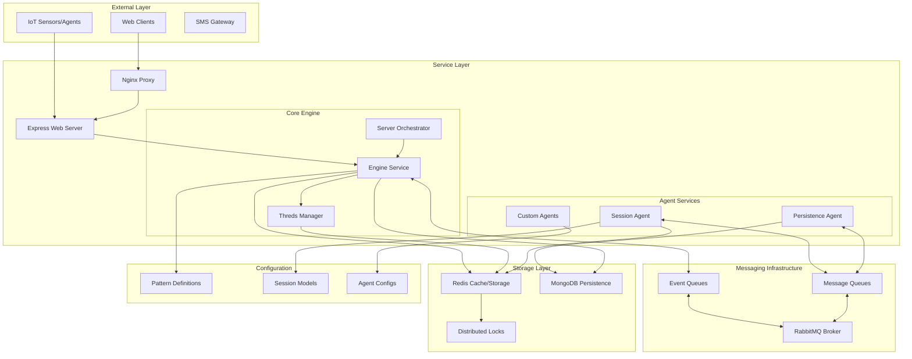
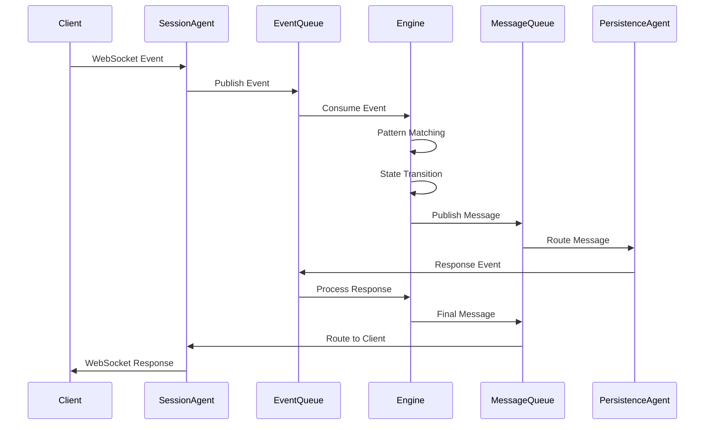

# SrvThreds: Comprehensive Technical Architecture Analysis

## Executive Summary

**SrvThreds** is a sophisticated **event-driven workflow automation platform** built on TypeScript that implements a distributed microservices architecture with advanced state machine capabilities. The system processes real-time events through configurable workflow patterns, managing complex multi-step processes with participant coordination, persistence, and scalable messaging infrastructure.

## Core Business Purpose

The platform serves as a **universal workflow orchestration engine** designed for:
- **Industrial IoT monitoring** (UAV detection, downtime management)
- **Real-time event processing** with complex business logic
- **Multi-participant coordination** across distributed systems
- **Stateful workflow management** with persistence and recovery
- **Scalable event-driven automation** for enterprise environments

## Technical Architecture Overview

### System Architecture Diagram



## Core Architectural Patterns

### 1. Event-Driven Architecture (EDA)

The system implements a pure event-driven architecture where:

- **Events** are immutable data structures representing state changes
- **Messages** are addressed events sent to specific participants
- **Patterns** define workflow logic as state machines
- **Threds** (threads) are stateful workflow instances

```typescript
// Core event flow pattern
Event → Engine → Pattern Matching → Thred State Machine → Message Dispatch → Agents
```

### 2. State Machine Pattern

Each workflow is implemented as a finite state machine:

```typescript
// From Thred.ts - State transition logic
static async consider(event: Event, thredStore: ThredStore, threds: Threds): Promise<void> {
    let inputEvent: Event | undefined = event;
    
    transitionLoop: do {
        const reactionResult = await thredStore.currentReaction?.apply(inputEvent, thredStore);
        if (!reactionResult) break transitionLoop;
        
        inputEvent = await Thred.nextReaction(thredStore, reactionResult.transition, inputEvent);
        // Continue until no more transitions
    } while (inputEvent);
}
```

### 3. Actor Model Implementation

The system implements an actor-like pattern where:
- **Threds** are actors with isolated state
- **Events** are messages between actors
- **Agents** are specialized actors for external integration
- **Distributed locking** ensures actor isolation

### 4. CQRS (Command Query Responsibility Segregation)

Clear separation between:
- **Command side**: Event processing, state mutations
- **Query side**: Data retrieval, reporting, monitoring

## Service Architecture & Interactions

### Core Engine Service

The **Engine** ([`src/ts/engine/Engine.ts`](../../src/ts/engine/Engine.ts)) is the central orchestrator:

```typescript
export class Engine implements MessageHandler {
    // Pulls events from inbound queue
    private async run() {
        while (true) {
            const message: QMessage<Event> = await this.inboundQ.pop();
            await this.consider(message.payload);
            await this.inboundQ.delete(message);
        }
    }
    
    // Processes events through state machines
    consider(event: Event): Promise<void> {
        return this.threds.consider(event);
    }
}
```

**Key Responsibilities:**
- Event queue processing
- Pattern matching and Thred lifecycle management
- Message dispatching to agents
- Error handling and recovery

### Agent Framework

**Agents** ([`src/ts/agent/Agent.ts`](../../src/ts/agent/Agent.ts)) provide pluggable service integration:

```typescript
export class Agent {
    // Generic agent framework
    async start() {
        // Load configuration from persistence
        this.agentConfig = await SystemController.get().getConfig(configName);
        
        // Dynamic module loading
        const Handler = await import(this.agentConfig.agentImpl);
        this.handler = new Handler({
            config: this.agentConfig,
            eventPublisher: this.eventPublisher
        });
        
        this.run(); // Start message processing loop
    }
}
```

**Specialized Agents:**
- **SessionAgent**: WebSocket/HTTP client management
- **PersistenceAgent**: Database operations
- **Custom Agents**: Domain-specific integrations (SMS, IoT, etc.)

### Session Management

**Sessions** ([`src/ts/sessions/Sessions.ts`](../../src/ts/sessions/Sessions.ts)) manage participant coordination:

```typescript
export class Sessions {
    // Resolve participant addresses to actual IDs
    getParticipantIdsFor(address: Address, thredContext?: ThredContext): Promise<string[]> {
        return this.addressResolver.getParticipantIdsFor(address, thredContext);
    }
}
```

**Features:**
- Dynamic participant resolution
- Group-based addressing
- Session lifecycle management
- Multi-channel support (WebSocket, REST, SMS)

## Messaging Infrastructure

### Queue Architecture

The system uses **RabbitMQ** with topic-based routing:

```json
// From rascal_config.json
{
  "exchanges": {
    "event-exchange": { "type": "topic" },
    "message-exchange": { "type": "topic" }
  },
  "bindings": [
    "event-exchange[#] -> event-queue",
    "message-exchange[org.wt.session1] -> session1-message-queue",
    "message-exchange[org.wt.persistence] -> persistence-message-queue"
  ]
}
```

### Message Flow Patterns



## Storage & Persistence Architecture

### Multi-Layer Storage Strategy

1. **Redis** ([`src/ts/storage/RedisStorage.ts`](../../src/ts/storage/RedisStorage.ts)): 
   - Session state
   - Thred state
   - Distributed locking
   - Pub/Sub messaging

2. **MongoDB** ([`src/ts/persistence/mongodb/MongoPersistence.ts`](../../src/ts/persistence/mongodb/MongoPersistence.ts)):
   - Event history
   - Pattern definitions
   - User data
   - Audit logs

### Distributed Locking

**Redlock** implementation ensures consistency:

```typescript
// From ThredsStore.ts - Distributed locking pattern
async withThredStore(thredId: string, op: (thredStore?: ThredStore) => Promise<any>): Promise<any> {
    return await this.storage.acquire(
        [{ type: Types.Thred, id: thredId }],
        [async () => {
            const thredStore = await this.getThreadStore(thredId);
            const result = await op(thredStore);
            if (thredStore) await this.saveThredStore(thredStore);
            return result;
        }]
    );
}
```

## Technology Stack Summary

| Layer | Technologies |
|-------|-------------|
| **Runtime** | Node.js, TypeScript |
| **Web Framework** | Express.js, Socket.IO |
| **Message Broker** | RabbitMQ (Rascal) |
| **Storage** | Redis, MongoDB |
| **Containerization** | Docker, Docker Compose |
| **Proxy** | Nginx |
| **Testing** | Vitest |
| **Build Tools** | TSC, npm scripts |

## Key Architectural Strengths

1. **Modularity**: Clean separation of concerns with pluggable agents
2. **Scalability**: Horizontal scaling with distributed state management
3. **Reliability**: Fault tolerance with message durability and state recovery
4. **Flexibility**: Pattern-driven configuration enables rapid workflow changes
5. **Performance**: Async processing with efficient resource utilization
6. **Maintainability**: Strong typing and comprehensive testing

## Related Documentation

- [Scalability & Performance Guide](./SCALABILITY.md)
- [Deployment Guide](./DEPLOYMENT.md)
- [Data Flow Patterns](./DATA_FLOW.md)
- [Configuration Management](./CONFIGURATION.md)
- [Security Architecture](./SECURITY.md)

---

*This document provides a comprehensive overview of the SrvThreds architecture. For specific implementation details, refer to the focused documentation linked above.*