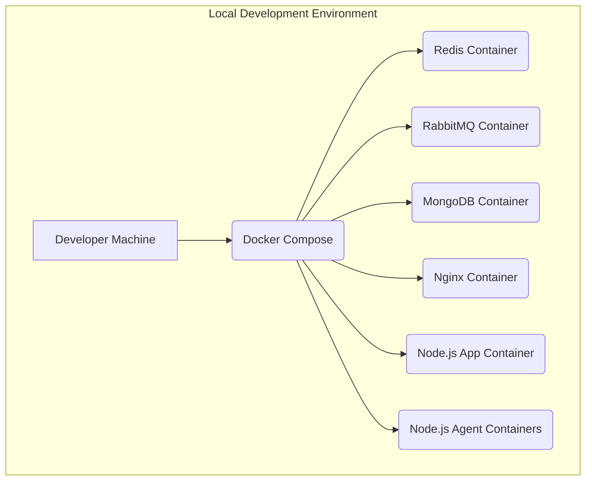
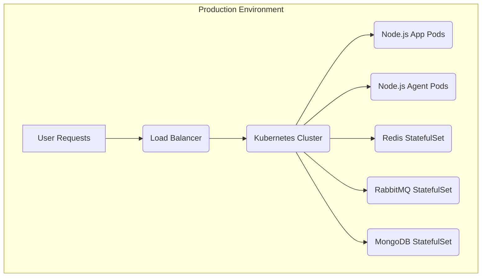
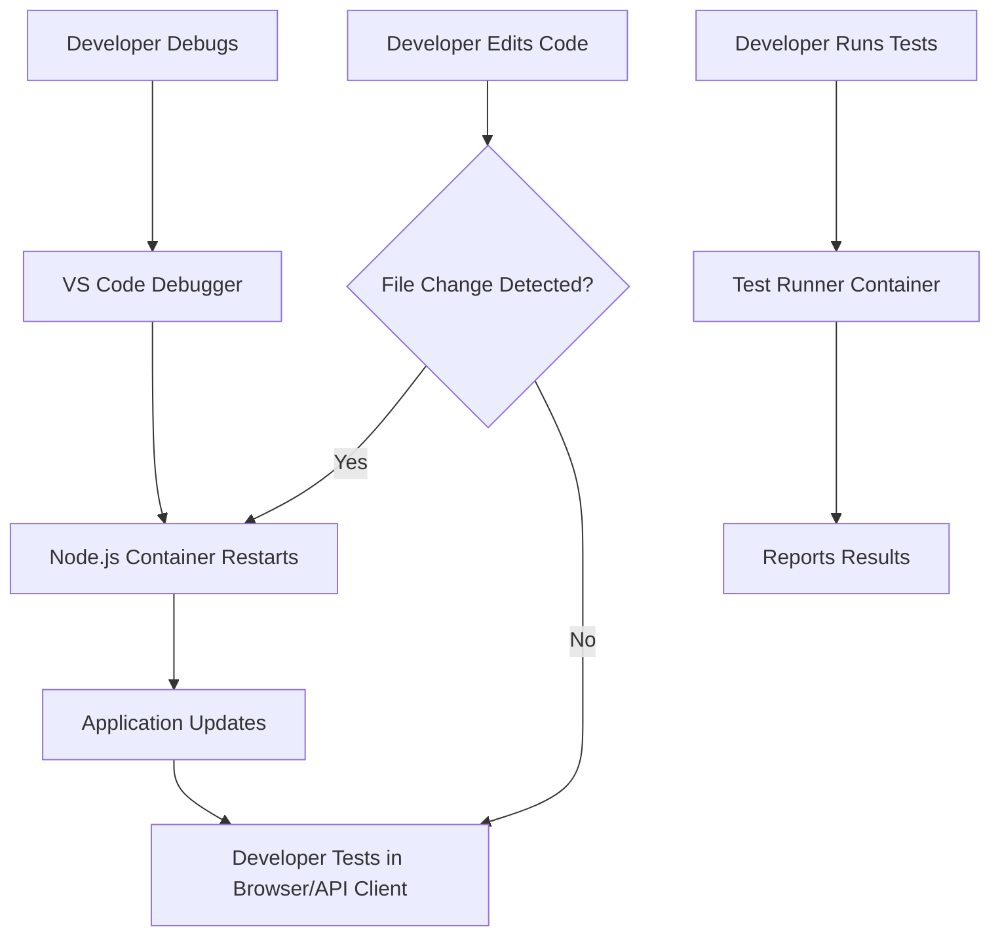

# Architectural Infrastructure Setup

## Notes:
1. Tool utilization: Terraform, docker, built in clustering
2. How to stream-line creating customer side agent to interact with our entry-point agent
  * This could involve multiple solutions and probably will for different types of targeted infrastructure

## Initial Focus
1. Identify our agents
2. Containerize our agents for deployment with scale limits
3. How do we want to cluster our environments/customers? Small scale per customer, one scale for all or a combination
4. Deployment updates for code

This document outlines an architectural approach for setting up local development environments that closely mimic production, leveraging existing Redis, RabbitMQ, and MongoDB services, along with stateless service agents. It also discusses tools for scaling and current orchestration patterns.

## 1. Current Environment Analysis

Based on the `docker-compose.yml` and `package.json` files:

*   **Existing Services (Docker Compose):** Redis, RabbitMQ, MongoDB, and Nginx are already defined as Docker services.
*   **Node.js Application:** A TypeScript project with a main application (`index.js` or `dev-server.ts`) and several "service agents" (`agent.js`, `remote-agent.js`).
*   **Local Development:** Currently, Node.js application services are run directly on the host using `tsx watch` or `nodemon`, while data stores and Nginx are containerized.

## 2. Proposed Plan

To achieve a production-like local environment and facilitate scaling, the following steps are proposed:

*   **Containerize Node.js Services:** Create Dockerfiles for the main application and the various service agents.
*   **Update Docker Compose:** Integrate the new Node.js service containers into `docker-compose.yml`. This will allow all services to run within Docker, mimicking a production environment more closely.
*   **Discuss Modern Orchestration Patterns:** Explore options like Kubernetes, Docker Swarm, and HashiCorp Nomad for production and local environments.
*   **Outline Strategies for Scaling the Infrastructure:** Address scaling for both application services and data stores.
*   **Define a Streamlined Local Development Workflow:** Establish best practices for efficient development with containerized services.
*   **Review and Feedback:** Gather user feedback on the proposed plan.

## 3. Modern Orchestration Patterns

### Overview

*   **Kubernetes (K8s):** Powerful, open-source system for automating deployment, scaling, and management of containerized applications. Ideal for production due to its scalability, high availability, and vast ecosystem. For local development, Minikube, Kind, or Docker Desktop's Kubernetes integration can be used.
*   **Docker Swarm:** Docker's native clustering and orchestration solution. Simpler to set up than Kubernetes, suitable for smaller-scale deployments or local orchestration.
*   **HashiCorp Nomad:** A flexible workload orchestrator, simpler than Kubernetes but more powerful than Docker Swarm. Integrates well with other HashiCorp tools.
*   **Cloud-Native Serverless/Managed Services:** Leveraging cloud provider services (e.g., AWS Fargate, Google Cloud Run, managed Kubernetes) to reduce operational overhead in production.

### Recommendation

Given your experience with Kubernetes and the desire for production-like local environments, **Kubernetes** is a strong candidate for production orchestration. For local development, a fully containerized setup using **Docker Compose** for all services (including Node.js apps/agents) is recommended initially, with the option to explore local Kubernetes (Minikube/Kind) for a closer production mimicry later.

### Architectural Diagrams

#### Local Development Environment


#### Production Environment


## 4. Strategies for Scaling the Infrastructure

### Application Services (Node.js App and Agents)

*   **Horizontal Scaling:** Deploy multiple replicas of stateless agents using orchestrators (Kubernetes, Docker Swarm, Nomad).
*   **Microservices Architecture:** Continue to decompose monolithic components for improved scalability and maintainability.
*   **Asynchronous Communication:** Utilize RabbitMQ for message queuing to decouple services and handle varying loads.

### Data Stores (Redis, RabbitMQ, MongoDB)

*   **Redis:** Implement Redis Cluster for horizontal data scaling and replication (master-replica) for read scalability and fault tolerance.
*   **RabbitMQ:** Form a RabbitMQ cluster with mirrored queues for high availability and message throughput. Consider Federation/Shovel for multi-region deployments.
*   **MongoDB:** Use Replica Sets for high availability and automatic failover. Implement Sharding for horizontal data scaling to handle large datasets and high throughput. Ensure proper indexing.

### General Scaling Considerations

*   **Infrastructure as Code (IaC):** Use tools like Terraform or Pulumi for declarative infrastructure provisioning, ensuring consistency across environments.
*   **Monitoring and Alerting:** Implement Prometheus & Grafana for observability, distributed tracing (Jaeger, OpenTelemetry) for request flow analysis, and centralized logging (ELK Stack, Loki) for debugging.

### Local Environment Scaling

*   **Docker Compose:** Easily scale services up or down using `replicas` in `docker-compose.yml`.
*   **Resource Limits:** Configure CPU and memory limits for containers to manage local resource consumption.
*   **Selective Service Startup:** Allow developers to start only necessary services.

## 5. Streamlined Local Development Workflow

The aim is to provide a production-like experience while maintaining developer velocity.

*   **Fully Containerized Local Environment:** All services run in Docker containers orchestrated by `docker-compose.yml`.
*   **Hot-Reloading for Node.js Services:** Use development-specific Dockerfiles or `docker-compose.override.yml` to mount source code and leverage `nodemon` or `tsx watch` for automatic restarts.
*   **Environment Variables Management:** Utilize `.env` files for environment-specific configurations, ensuring consistency with production.
*   **Simplified Service Interaction:** Services discover each other by name within the Docker network; map necessary ports to the host.
*   **Debugging Capabilities:** Configure remote debugging for Node.js services in containers, accessible via VS Code.
*   **Database Seeding/Migration:** Use `docker-entrypoint-initdb.d` for initial setup and provide scripts for on-demand database operations.
*   **Testing Integration:** Run tests within containers for a consistent testing environment.
*   **Documentation:** Provide clear instructions for setting up and using the local environment.

#### Local Development Workflow Diagram


## 6. Kubernetes Manifests for Local (Minikube) and Production Deployments

This section outlines the Kubernetes resources and considerations for deploying your services, adaptable for both local Minikube environments and a production Kubernetes cluster. Tools like Kustomize or Helm are recommended for managing environment-specific configurations.

### Node.js Application and Agent Services

Your Node.js application and stateless agents will be deployed as standard Kubernetes workloads.

*   **`Deployment`**:
    *   **Purpose**: Manages a set of identical, stateless pods. Ideal for your Node.js application and agents.
    *   **Configuration**:
        *   `replicas`: Define the desired number of instances for horizontal scaling.
        *   `selector`: Labels to identify the pods managed by this deployment.
        *   `template.spec.containers`:
            *   `image`: Reference the Docker images for your Node.js app/agents (e.g., `your-repo/node-app:latest`).
            *   `ports`: Expose the application's port (e.g., 3000).
            *   `env`: Environment variables for configuration (e.g., database connection strings, RabbitMQ host). These can be sourced from `ConfigMap` or `Secret`.
            *   `resources`: Define CPU and memory `requests` and `limits` for efficient resource management.
            *   `livenessProbe` & `readinessProbe`: Health checks to ensure the application is running and ready to serve traffic.
*   **`Service` (Type: ClusterIP)**:
    *   **Purpose**: Provides a stable internal IP address and DNS name for accessing the Node.js application and agents within the cluster.
    *   **Configuration**:
        *   `selector`: Matches the labels of the pods managed by the `Deployment`.
        *   `ports`: Maps a service port to the container port.

### Redis Cluster

For a highly available and scalable Redis setup, a `StatefulSet` is the appropriate choice.

*   **`StatefulSet`**:
    *   **Purpose**: Manages stateful applications, ensuring stable network identities, persistent storage, and ordered deployment/scaling. Essential for Redis clustering.
    *   **Configuration**:
        *   `replicas`: Define the number of Redis nodes (e.g., 3 or 6 for a cluster).
        *   `serviceName`: References a headless service for stable network identities.
        *   `template.spec.containers`:
            *   `image`: `redis:latest` or a specific version.
            *   `command`: Commands to initialize and run Redis in cluster mode (e.g., `redis-server --appendonly yes --cluster-enabled yes --cluster-config-file nodes.conf --cluster-node-timeout 5000 --port 6379`).
            *   `volumeMounts`: Mount `PersistentVolumeClaim` for data persistence.
        *   `volumeClaimTemplates`: Dynamically provisions `PersistentVolume` for each Redis instance.
*   **`Service` (Type: ClusterIP, Headless)**:
    *   **Purpose**: A headless service (no `clusterIP`) is used with `StatefulSet` to provide unique DNS entries for each pod, crucial for Redis cluster discovery.
*   **`ConfigMap`**:
    *   **Purpose**: Store Redis configuration files or parameters.

### RabbitMQ Cluster

Similar to Redis, RabbitMQ clustering benefits from a `StatefulSet`.

*   **`StatefulSet`**:
    *   **Purpose**: Manages RabbitMQ nodes, ensuring stable identities and persistent data.
    *   **Configuration**:
        *   `replicas`: Number of RabbitMQ nodes in the cluster.
        *   `serviceName`: References a headless service.
        *   `template.spec.containers`:
            *   `image`: `rabbitmq:3-management` or a specific version.
            *   `env`: Environment variables for RabbitMQ (e.g., `RABBITMQ_ERLANG_COOKIE`, `RABBITMQ_NODENAME`).
            *   `volumeMounts`: Mount `PersistentVolumeClaim` for data persistence.
        *   `volumeClaimTemplates`: Dynamically provisions `PersistentVolume` for each RabbitMQ instance.
*   **`Service` (Type: ClusterIP, Headless)**:
    *   **Purpose**: Headless service for stable DNS entries for RabbitMQ nodes.
*   **`Service` (Type: ClusterIP or NodePort/LoadBalancer for Management UI)**:
    *   **Purpose**: Expose RabbitMQ ports (5672 for AMQP, 15672 for management UI) within the cluster or externally.
*   **`Secret`**:
    *   **Purpose**: Store sensitive RabbitMQ credentials (e.g., default user/pass, Erlang cookie).

### MongoDB Replica Set

MongoDB replica sets are also best managed with a `StatefulSet`.

*   **`StatefulSet`**:
    *   **Purpose**: Manages MongoDB instances, ensuring data persistence and replica set configuration.
    *   **Configuration**:
        *   `replicas`: Number of MongoDB instances (e.g., 3 for a replica set).
        *   `serviceName`: References a headless service.
        *   `template.spec.containers`:
            *   `image`: `mongo` or a specific version.
            *   `command`: Commands to run `mongod` with replica set configuration (e.g., `--replSet rs0`).
            *   `volumeMounts`: Mount `PersistentVolumeClaim` for data persistence.
        *   `volumeClaimTemplates`: Dynamically provisions `PersistentVolume` for each MongoDB instance.
*   **`Service` (Type: ClusterIP, Headless)**:
    *   **Purpose**: Headless service for stable DNS entries for MongoDB nodes.
*   **`Service` (Type: ClusterIP)**:
    *   **Purpose**: Expose MongoDB port (27017) within the cluster.
*   **`ConfigMap`**:
    *   **Purpose**: Store MongoDB initialization scripts or configuration.

### Nginx Ingress

If Nginx is primarily for routing external traffic to your Node.js application.

*   **`Ingress`**:
    *   **Purpose**: Manages external access to services in a cluster, typically HTTP/HTTPS. Requires an Ingress Controller (e.g., Nginx Ingress Controller) to be running in the cluster.
    *   **Configuration**:
        *   `rules`: Define hostnames and paths to route to specific backend services.
        *   `tls`: Configure SSL/TLS certificates.
*   **Alternatively, `Deployment` and `Service` (Type: LoadBalancer/NodePort)**:
    *   If Nginx is performing more complex logic or acting as a reverse proxy for internal services, it can be deployed as a regular `Deployment` with a `Service` to expose it.

### Configuration and Secrets Management

*   **`ConfigMap`**:
    *   **Purpose**: Store non-sensitive configuration data (e.g., application settings, feature flags).
*   **`Secret`**:
    *   **Purpose**: Store sensitive information (e.g., database passwords, API keys, RabbitMQ credentials).

### Local (Minikube) vs. Production Differences

*   **Storage Classes**:
    *   **Minikube**: Often uses `hostPath` or a simple `standard` storage class provided by Minikube.
    *   **Production**: Will use cloud-provider specific storage classes (e.g., `gp2` on AWS, `standard` on GCP/Azure).
*   **Resource Requests/Limits**:
    *   **Minikube**: Might be lower to conserve local machine resources.
    *   **Production**: Tuned for optimal performance and stability.
*   **External Access**:
    *   **Minikube**: `NodePort` services or `minikube service` command for accessing services.
    *   **Production**: `LoadBalancer` services or `Ingress` resources with a dedicated Ingress Controller.
*   **Image Pull Policy**:
    *   **Minikube**: `IfNotPresent` or `Never` (if building locally).
    *   **Production**: `Always` to ensure the latest image is pulled.
*   **Kustomize/Helm**: These tools are highly recommended for managing these environment-specific variations without duplicating manifest files.

## 7. Refined Local Development Workflow with Minikube

This section details a local development experience that closely mirrors a production Kubernetes environment, leveraging Minikube for local orchestration.

### Minikube Setup and Management

*   **Installation:** Guide developers on installing Minikube and a compatible hypervisor (e.g., Docker Desktop, VirtualBox, Hyper-V).
*   **Starting/Stopping Minikube:** Provide clear commands for `minikube start` and `minikube stop`.
*   **Context Switching:** Instruct on using `kubectl config use-context minikube` to switch between local and remote Kubernetes clusters.

### Containerization of All Services

*   **Dockerfiles:** Create Dockerfiles for all Node.js application services and agents.
*   **Minikube Docker Daemon:** Leverage `eval $(minikube docker-env)` to use Minikube's Docker daemon for building images directly into the Minikube environment, avoiding image push/pull to a registry for local development.

### Deploying Services to Minikube

*   **Kubernetes Manifests:** Use the Kubernetes manifests (Deployments, StatefulSets, Services, ConfigMaps, Secrets) developed in the previous step.
*   **`kubectl apply`:** Deploy services to Minikube using `kubectl apply -f <manifest_file.yaml>`.
*   **Kustomize for Local Overrides:** Use Kustomize to manage environment-specific configurations. For example, a `kustomization.yaml` could apply different resource limits or image pull policies for Minikube vs. production.
    *   **Base Manifests:** Generic Kubernetes manifests.
    *   **Overlays:** `minikube` overlay to apply local-specific configurations (e.g., `hostPath` volumes for persistence, lower resource requests).
*   **Helm Charts (Alternative/Advanced):** For more complex applications, Helm charts can package and deploy services, offering templating and release management.

### Local Development with Hot-Reloading in Minikube

*   **`minikube mount` (for source code):** While `minikube docker-env` is good for images, for hot-reloading, consider mounting local source code into the Minikube VM. This can be complex and might not be ideal for all setups.
*   **Local Image Builds and Redeploy:** A more common approach for hot-reloading in Minikube is to:
    1.  Make code changes locally.
    2.  Rebuild the Docker image using `eval $(minikube docker-env)` and `docker build -t your-app:latest .`.
    3.  Force a redeployment of the Kubernetes `Deployment` (e.g., `kubectl rollout restart deployment/your-app`). This provides a fast feedback loop, though not as instantaneous as direct volume mounts.
*   **`skaffold` (Recommended for Dev Workflow):** A powerful tool that automates the workflow for building, pushing, and deploying applications to Kubernetes. It can detect code changes, rebuild images, and redeploy to Minikube automatically, providing a seamless hot-reloading experience.

### Accessing Services in Minikube

*   **`minikube service <service-name>`:** Automatically opens the service in a browser or provides the URL.
*   **`kubectl port-forward`:** Forward a port from a pod to the local machine for direct access and debugging.
*   **Ingress:** Configure an Ingress controller in Minikube (e.g., `minikube addons enable ingress`) and define `Ingress` resources to access services via hostnames.

### Debugging in Minikube

*   **Remote Debugging:** Configure Node.js pods to enable remote debugging (e.g., `--inspect=0.0.0.0:9229`). Use `kubectl port-forward` to expose the debug port to the local machine, allowing VS Code to attach.
*   **Centralized Logging:** Use `kubectl logs -f <pod-name>` or integrate with a local logging stack (e.g., Loki/Grafana running in Minikube).

### Database Management in Minikube

*   **Persistent Volumes:** Ensure `PersistentVolumeClaims` are correctly configured for Redis, RabbitMQ, and MongoDB to retain data across Minikube restarts.
*   **Initialization Scripts:** Use `initContainers` in Kubernetes manifests to run database seeding or migration scripts.

### CI/CD Alignment

*   The Minikube setup should closely mirror the CI/CD pipeline's deployment process to ensure consistency and catch issues early.

#### Local Development Workflow with Minikube Diagram
```mermaid
graph TD
    A[Developer Edits Code] --> B(Skaffold/Manual Build)
    B --> C(Docker Image Build in Minikube)
    C --> D(Kubernetes Deployment Update)
    D --> E[Minikube Pod Restarts]
    E --> F[Application Updates]
    F --> G[Developer Tests in Browser/API Client]
    H[Developer Debugs] --> I(kubectl port-forward)
    I --> J[VS Code Debugger]
    J --> E
